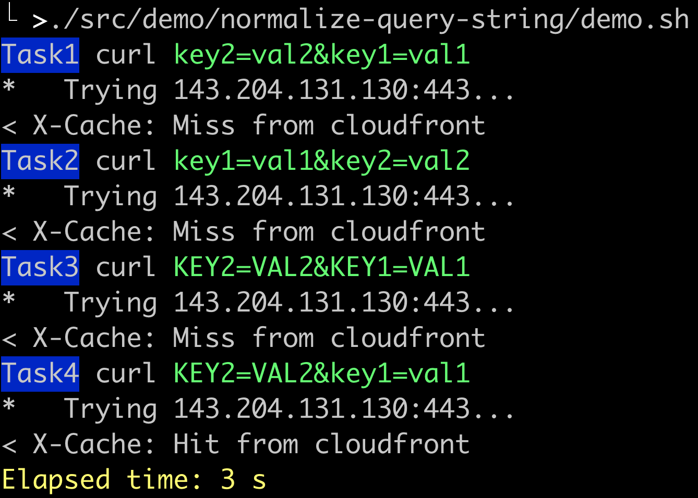

# How to Test

```sh
yarn watch
```
Open a seperate terminal and run:

```sh
AWS_REGION=us-east-1 cdk --app lib/demo/normalize-query-string/index.js diff
AWS_REGION=us-east-1 cdk --app lib/demo/normalize-query-string/index.js deploy

```

On deploy completed, modify cloudfront domain name(`cfdomain`) in `demo.sh`, and then execute this script.
```sh
vim ./src/demo/normalize-query-string/demo.sh
./src/demo/normalize-query-string/demo.sh
```

Sample output


